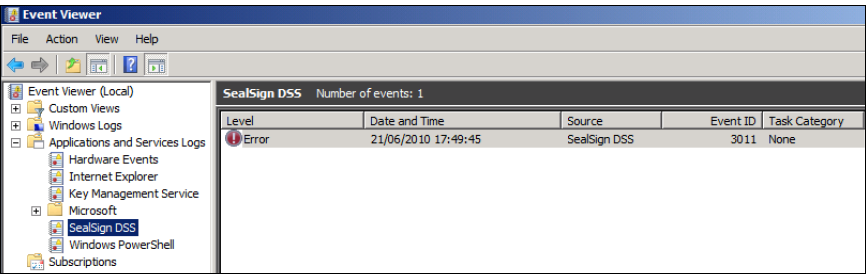
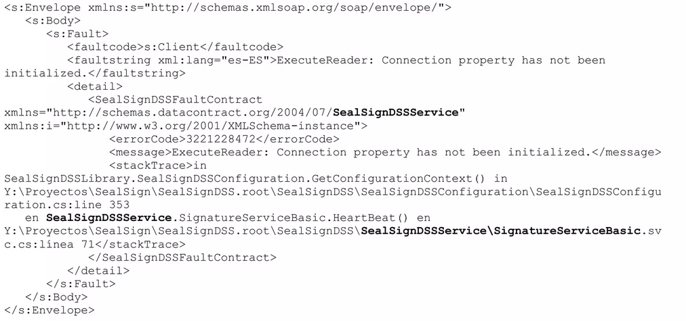
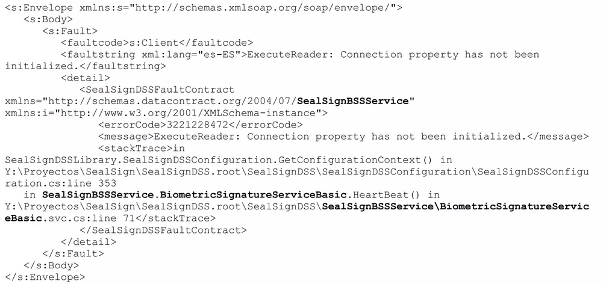
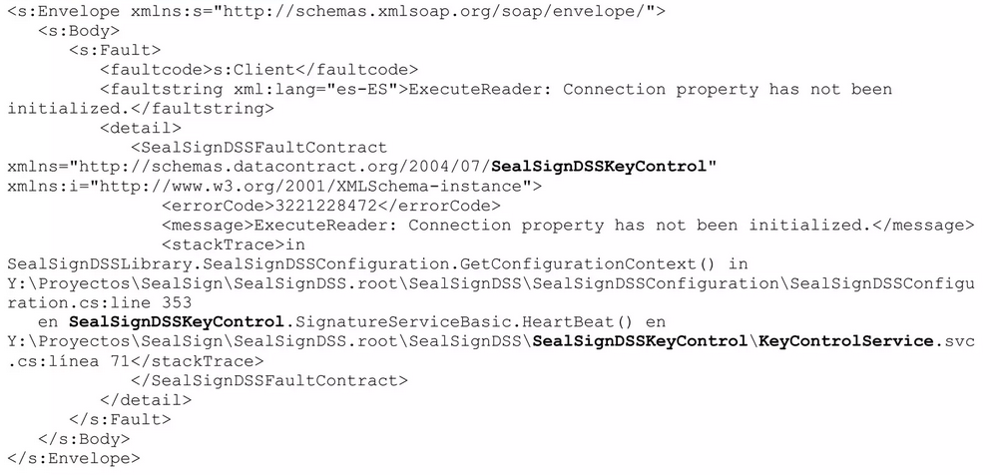
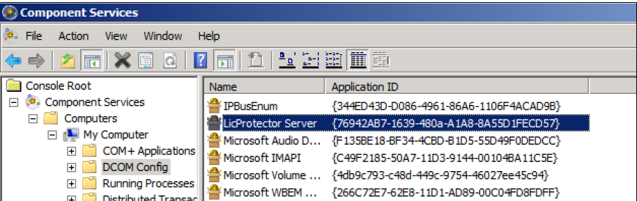
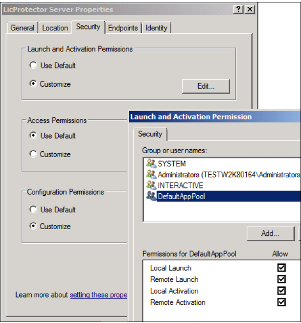

# **SealSign monitoring guide (include DSS, BSS, CKC)**

## 1. Instrumentation

The services have various instrument types so that the administrator can control the application's status and performance

The following elements ara available:

- **IIS Events and Logs:** The services use the IIS platform intensely. Thus, events regarding platform issues under the application level can be monitored following Microsoft recommended practices.
  form more information:

  [http://technet.microsoft.com/en-us/library/cc730608(v=ws.10).aspx](<http://technet.microsoft.com/en-us/library/cc730608(v=ws.10).aspx>)

- **SealSign events:** The installation process for the electronic and biometric signature services includes a SealSign-specific error monitoring and tracking system. Thus, all errors, warnings and information alerts will appear in the application's Log integrated in Microsoft Windows.

  The log is called SealSign DSS and resides within the Applications and Services Log node:

||
|:--:|
|*Image 01: SealSign in Event Viewer*|


- **WCF trace file:** The services SealSign harness WCF technology for communications with client applications. If communications issues arise from protocol or service errors, enabling WCF tracing is normally useful.

  SealSign setup files (web.config) include, commented, parameters necessary for activating these traces.

  For more information:

  [http://msdn.microsoft.com/en-us/library/ms731859(v=vs.90).aspx](<http://msdn.microsoft.com/en-us/library/ms731859(v=vs.90).aspx>)

- **Audit log:** SealSign has an auditing system so that the administrator can ascertain what operations are running in the system, who is running them and their results. This recor is stored in the SealSign DB.

## 2. Monitoring

### 2.1. Heartbeat

Some installations require the incorporation of a heartbeat mechanism to determine the platform health status even with no client request. The SealSign services enable a basic check from version 2.10 through a SOAP call to the HeartBeat method. This method will execute the normal initializations of a signing operation (access to licenses, access to DB, etc.). The following examples illustrate a call, correct response and DB access error response: 

#### 2.1.1. Request example

```xml
<soapenv:Envelope xmlns:soapenv="http://schemas.xmlsoap.org/soap/envelope/"
xmlns:tem="http://tempuri.org/">
    <soapenv:Header/>
    <soapenv:Body>
    <tem:HeartBeat/>
    </soapenv:Body>
</soapenv:Envelope>
```

#### 2.1.2. Correct response example

```xml
<s:Envelope xmlns:s="http://schemas.xmlsoap.org/soap/envelope/">
<s:Body>
<HeartBeatResponse xmlns="http://tempuri.org/"/>
</s:Body>
</s:Envelope>
```

### 2.1.3. Response with a DB Access problem

In this case the responses are exactly the same, except for the paths, which differ as one module or the other is used, therefore an exampe will be displayed for each one of these.

> :paperclip: For a better appreciation of the differences between the responses from each module, the differences between each one of the responses have been written in bold.


**CASO 1: DSS MODULE**




**CASO 2: BSS MODULE**




**CASO 3: CKC MODULE**



## 3. Events reference

In addition to a description and most significant parameters of the issue, each event includes a representation of the stack with the method causing the error.

### 3.1. Categories

- **Development events:** Events under this category are linked to development and integration aspects on the platform. The actions to undertake correspond to the developer of the client application and no actions need be taken by the platform administrator.
- **Critical events:** Critical events entail an issue that prevents platform operation at a general level. Urgent corrective actions from the platform administrator will be required.
- **Operation events:**  Status events entail a problem associated with a specific operation and do not affect platform operation. Depending on the error, corrective actions from the platform administrator may be necessary. 

### 3.2. Events

Below are some of the most common issues that could occur during SealSign DSS operation. These events are recorded in the SealSign DSS specific application log. 

| Event      | Message(en-es)                                                                                                                        | Description                                                                                                                     | Category            | Corrective actions                                                                                                                                                                                    |
| ----------- | ------------------------------------------------------------------------------------------------------------------------------------- | ------------------------------------------------------------------------------------------------------------------------------- | -------------------- | ------------------------------------------------------------------------------------------------------------------------------------------------------------------------------------------------------- |
| Event 3000 | - An unhandled exception has occurred on SealSignDSS. <br>-Se ha producido una excepción no controlada en SealSign DSS.               | This event indicates a generic service execution error.                                                              | Operation event. | - Detect the error cause under the event description in the SealSign log.<br>- Export the application, system and SealSign logs and report them to the Factum Identity support service. |
| Event 3001 | - An error has occurred accessing SealSign DSS database.<br>- Se ha producido un error al acceder a la base de datos de SealSign DSS. | This event indicates a DB access error. This issue normally arises when DB connectivity has been lost. | Critical event.      | - Check DB connectivity.<br>- Check the DB access security configuration from the IIS Pool.                                                                         |
| Event 3002 | - An error has occurred accessing PKCS#11 device.<br>- Se ha producido un error accediendo a un dispositivo PKCS#11.                  | This event indicates an error in accessing the PKCS11 device where the certificates are located.                  | Critical event.      | -Detect the error cause under the event description in the SealSign Log.<br>- Export the application system and SealSign logs and report them to the Factum Identity support service.   |
| Event 3003 | - An error has occurred while creatingtimestamp request.<br>- Se ha producido un error durante la creación de una petición de sellado de tiempo. |Este evento indica un error de acceso al proveedor de sellos de tiempo. Este problema se suele producir cuando la conectividad con el proveedor de sellos de tiempo se ha perdido. |Evento crítico. |- Comprobar la conectividad con el proveedor de sellos de tiempo.<br>- Comprobar el estado de licenciamiento del proveedor de sellos de tiempo. |
  |Event 3005 | - An error has occurred opening a PKCS#12 file.<br>- Se ha producido un error abriendo un fichero PKCS#12.|Este evento indica un error importando o abriendo un certificado almacenado en un fichero PKCS#12 (p12 o pfx). |Evento de operación. |- Comprobar el formato del fichero a importar con herramientas externas. |
  |Evento 3006 |- A password error has occurred opening a PKCS#12 file.<br>- Se ha producido un error de contraseña abriendo un fichero PKCS#12. | Este evento indica un error de contraseña importando o abriendo un certificado almacenado en un fichero PKCS#12 (p12 o pfx).|Evento de operación. |- Comprobar la contraseña del fichero a importar con herramientas externas.<br>- Si el certificado que está siendo utilizado corresponde a un certificado usado por la plataforma servidora de SealSign será necesario revisar la configuración, reescribiendo la contraseña si fuese necesario. |
|Event 3007 |- A error has ocurred validating a certificate.<br>- Se ha producido un error validando un certificado. |Este evento indica un error criptográfico al validar un certificado de una firma electrónica. Por ejemplo, si el certificado está mal formado. |Evento de operación. | - Si el certificado que está siendo validado corresponde a un certificado utilizado por la plataforma servidora de SealSign será necesario revisar la configuración, reimportando el certificado si fuese necesario.|
|Event 3008 |- An invalid argument has been received.<br>- Se ha recibido un argumento inválido. |Este evento indica una llamada a un método del servicio con un parámetro erróneo. En la descripción del evento se identificará el parámetro que está ocasionando el problema. |Evento de desarrollo. |- Revisar la llamada desde la aplicación cliente. |
|Event 3009 |- An error has occurred obtaining configuration from SealSign DSS database.<br>- Se ha producido un error obteniendo la configuración de la base de datos de SealSign DSS. |Este evento indica un error de acceso a la BBDD de configuración del servicio. Se suele producir cuando la versión de la BBDD de configuración difiere de la versión del servicio. En la descripción del evento se identificará el punto donde se ha producido el error. | Evento crítico.| - Identificar la causa del error en la descripción del evento en el Log de SealSign.<br>- Comprobar la conectividad con la BBDD.<br>- Comprobar la configuración de seguridad de acceso a la BBDD desde el Pool de IIS. <br>- Restaurar la BBDD de configuración de backup.|
|Event 3011 |- An error has ocurred obtaining license information:Retrieving the COM class factory for component with CLSID {554A6D3B-2FEF-4C2F-B34C-AF6185EB2759} failed due to the following error: 80070005. at SealSignDSSLibrary .SealSignDSSLicense. InitializeLicense(String licenseFile). | Este error se produce generalmente cuando el usuario con el que está configurado el Pool no tiene permisos para instanciar el componente de gestión de licencias. Dicho componente se registra en la maquina durante el proceso de instalación.| Event crítico. | - Para dar permisos de activación al usuario del Pool se puede utilizar la herramienta DCOMCNFG.EXE y buscar el componente LicProtector Server, (véase imagen 02).<br>- A continuación se debe acceder a la pestaña de seguridad, marcar la opción personalizada de permisos de activación y dar permisos al usuario del Pool, (véase imagen 03).|
|Event 3012 | - Document format is not valid.<br>- El formato deldocumento no es válido. |Este evento indica un error de formato en el documento que está siendo firmado. |Evento de operación. |- Revisar que en la aplicación cliente el formato especificado y el formato real del documento coinciden. |
|Event 3014 |-License not initialized.<br>- Licencia no inicializada. | Este evento indica un error de acceso al fichero de licencia del producto o una licencia invalida.|Evento crítico. | - Identificar la causa del error en la descripción del evento en el Log de SealSign.<br>- Revisar permisos de acceso del fichero de licencias desde el Pool de IIS.<br>- Exportar los logs de aplicación, sistema y SealSign, y reportarlos al servicio de soporte de Factum Identity.|
|Event 3015|- A password error has occurred accessing a PKCS#11 device.<br>- Se ha producido un error accediendo a un dispositivo PKCS#11.|Este evento indica un error de contraseña accediendo a un certificado almacenado en un slot PKCS#|Evento de operación.|- Comprobar la contraseña del slot con herramientas externas.<br>- Si el certificado que está siendo utilizado corresponde a un certificado usado por la plataforma servidora de SealSign será necesario revisar la configuración, reescribiendo la contraseña si fuese necesario.|
|Event 3016|- The SealSign license information is not valid or has been modified.<br>- La información de licencia de SealSign no es válida o ha sido modificada.|Este evento indica un error de acceso al fichero de licencia del producto o una licencia invalida.|Evento crítico.|-Identificar la causa del error en la descripción del evento en el Log de SealSign.<br>- Revisar permisos de acceso del fichero de licencias desde el Pool de IIS.<br>- Exportar los logs de aplicación, sistema y SealSign, y reportarlos al servicio de soporte de Factum Identity.|
|Event 3020|- A security error has occurred.<br>- Se ha producido un error de seguridad.|Este evento indica un error de acceso denegado a métodos de administración. Se suele producir cuando un usuario sin permisos trata de modificar la configuración del producto.|Evento de operación.|- Revisar la configuración de seguridad de la cuenta del usuario. Para realizar tareas administrativas en la plataforma es necesario que el usuario pertenezca al grupo SealSignDSS Admins.|
|Event 3035|- Encrypted credential could not be decrypted with current certificate.<br>- La credencial no se pudo descifrar con el certificado actual.|Este evento indica un error de acceso a las credenciales de una firma biométrica (metadatos y patrón biométrico) <sup>1</sup>.|Event de operación.|- Importar la clave privada del certificado en la plataforma.|

  ><sup>(1)</sup> Because the information is encrypted with a public key and the platform does not have the corresponding private key. This issue usually occurs when verifying a signature on a document encrypted with a certificate held by a trusted third party or with a certificate pertaining to another instance of the platform. 

|  | 
|:--:| 
| *Image 02: LicProtector Server component (see event 3011)* |


|  | 
|:--:| 
| *Image 03: Grant of permits to the user from the Pool (see event 3011)* |
