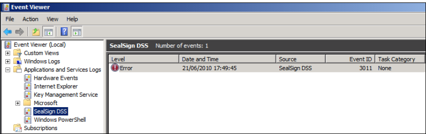
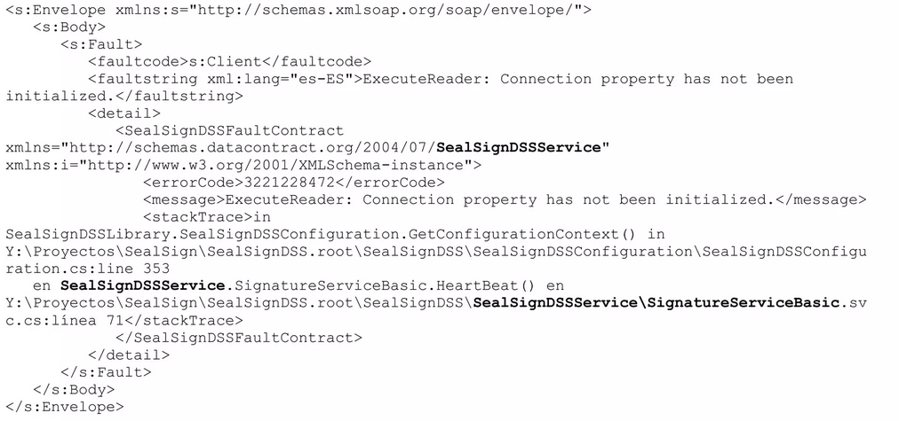
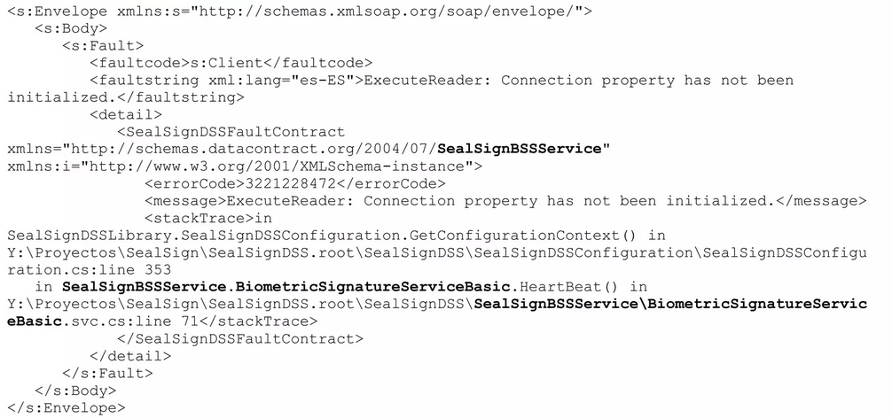
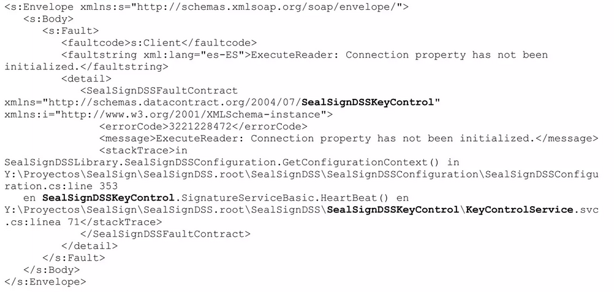
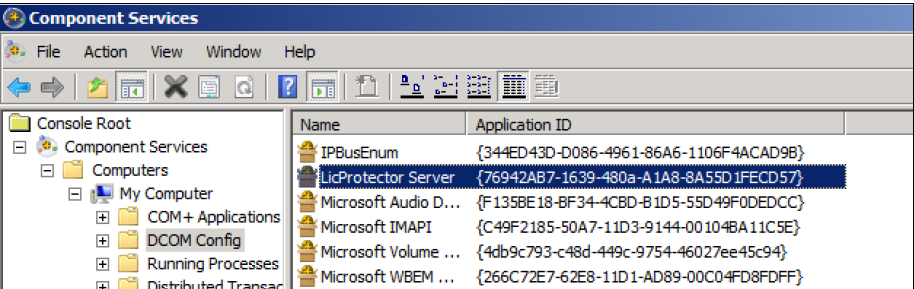
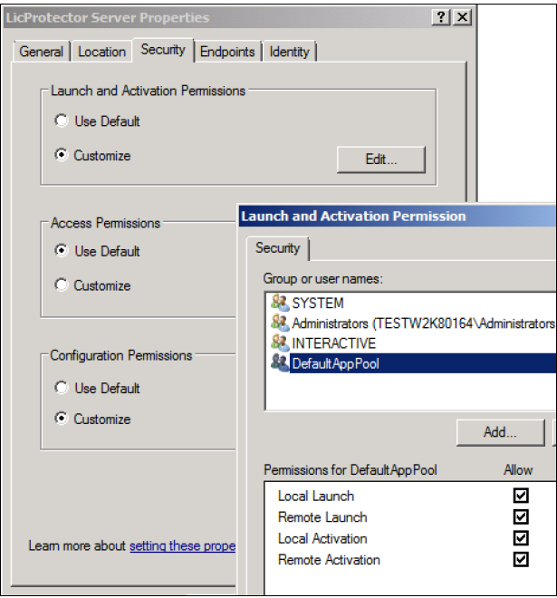

# **Guía de monitorización de SealSign (incluye DSS, BSS, CKC)**

## 1. Instrumentación

Los servicios SealSign proveen diversos tipos de instrumentos que permiten controlar el estado y comportamiento de la aplicación por su administrador.

Los elementos disponibles son los siguientes:

- **Eventos y Log del IIS:** Los servicios SealSign hacen uso intensivo de la plataforma IIS. De esta forma,
  los eventos relativos a problemas en la plataforma, por debajo del nivel de aplicación, se pueden
  monitorizar siguiendo las prácticas recomendadas por Microsoft.
  Para más información:

  [http://technet.microsoft.com/en-us/library/cc730608(v=ws.10).aspx](<http://technet.microsoft.com/en-us/library/cc730608(v=ws.10).aspx>)

- **Eventos de SealSign:** En el proceso de instalación de los servicios de firma electrónica y biométrica se incluye un sistema de monitorización y seguimiento de errores propio de SealSign. De esta forma todos los errores, avisos y mensajes informativos se registran en su propio Log de aplicación integrado en Microsoft Windows.

  El log se denomina SealSign DSS y reside bajo el nodo de Log de Aplicaciones y Servicios:

||
|:--:|
|*Imagen 01: SealSign en el visor de eventos de Microsoft Windows*|


- **Fichero de trazado WCF:** Los servicios SealSign hacen uso de la tecnología WCF para la comunicación con las aplicaciones cliente. En caso de problemas en la comunicación, debidos tanto a errores de protocolo como del servicio, suele ser útil habilitar las trazas de WCF.

  Los ficheros de configuración (web.config) de SealSign incluyen, comentados, los parámetros necesarios para activar dichas trazas.

  Puede accederse a más información en la siguiente dirección web:

  [http://msdn.microsoft.com/en-us/library/ms731859(v=vs.90).aspx](<http://msdn.microsoft.com/en-us/library/ms731859(v=vs.90).aspx>)

- **Registro de Auditoría:** SealSign dispone de un sistema de auditoría que permitirá al administrador
  conocer qué operaciones se realizan en el sistema, quién las realiza y el resultado de estas. Este
  registro se almacena en la BBDD de SealSign.

## 2. Monitorización

### 2.1. Heartbeat

En algunas instalaciones es necesario implementar un mecanismo de heartbeat que permita, aun sin peticiones de clientes, determinar el estado de salud de la plataforma. Los servicios SealSign permiten realizar una comprobación básica a partir de la versión 2.10 mediante una llamada SOAP al método HeartBeat. Dicho método realizará las inicializaciones típicas de una operación de firma (acceso a licencias, acceso a BBDD, etcétera). A continuación, se muestra un ejemplo de llamada, un ejemplo de respuesta correcta y otro con error de acceso a BBDD.

#### 2.1.1. Ejemplo de llamada

```xml
<soapenv:Envelope xmlns:soapenv="http://schemas.xmlsoap.org/soap/envelope/"
xmlns:tem="http://tempuri.org/">
    <soapenv:Header/>
    <soapenv:Body>
    <tem:HeartBeat/>
    </soapenv:Body>
</soapenv:Envelope>
```

#### 2.1.2. Ejemplo de respuesta correcta

```xml
<s:Envelope xmlns:s="http://schemas.xmlsoap.org/soap/envelope/">
<s:Body>
<HeartBeatResponse xmlns="http://tempuri.org/"/>
</s:Body>
</s:Envelope>
```

### 2.1.3. Respuesta con problema de acceso a BBDD

En este caso las respuestas son exactamente iguales, salvo las rutas, que difieren según se utilice un módulo u otro, por lo que se va a mostrar un ejemplo de cada uno de ellos.

> :paperclip: Para una mejor apreciación de las diferencias entre las respuestas de cada módulo, se ha resaltado en negrita las diferencias existentes entre cada una de las respuestas.


**CASO 1: MODULO DSS**




**CASO 2: MODULO BSS**




**CASO 3: MODULO CKC**



## 3. Referencia de Eventos

Cada evento, además de una descripción y los parámetros más significativos del problema, incluye una representación de la pila con el método que produce el error.

### 3.1. Categorías

- **Eventos de Desarrollo:** Los eventos bajo esta categoría están relacionados con aspectos de desarrollo
  e integración en la plataforma. Las acciones por realizar corresponden al desarrollador de la aplicación
  cliente y no serán necesarias acciones por parte del administrador de la plataforma.
- **Eventos Críticos:** Los eventos críticos implican un problema que impide el funcionamiento de la
  plataforma a nivel general. Serán necesarias acciones correctoras urgentes por parte del
  administrador de la plataforma.
- **Eventos de Operación:** Los eventos de estado implican un problema asociado a una operación concreta
  y no afectan al funcionamiento de la plataforma. Dependiendo del error pueden ser necesarias
  acciones correctoras por parte del administrador de la plataforma.

### 3.2. Posibles Eventos

A continuación, se muestra una tabla con los problemas más comunes que pueden ocurrir durante la operación de SealSign. Estos eventos se registran en el log de aplicación específico de SealSign.

| Evento      | Mensaje(en-es)                                                                                                                        | Descripción                                                                                                                     | Categoría            | Acciones correctoras                                                                                                                                                                                    |
| ----------- | ------------------------------------------------------------------------------------------------------------------------------------- | ------------------------------------------------------------------------------------------------------------------------------- | -------------------- | ------------------------------------------------------------------------------------------------------------------------------------------------------------------------------------------------------- |
| Evento 3000 | - An unhandled exception has occurred on SealSignDSS. <br>-Se ha producido una excepción no controlada en SealSign DSS.               | Este evento indica un error genérico en la ejecución del servicio.                                                              | Evento de operación. | - Identificar la causa del error en la descripción del evento en el Log de SealSign.<br>- Exportar los logs de aplicación, sistema y SealSign, y reportarlos al servicio de soporte de Factum Identity. |
| Evento 3001 | - An error has occurred accessing SealSign DSS database.<br>- Se ha producido un error al acceder a la base de datos de SealSign DSS. | Este evento indica un error de acceso a BBDD. Este problema se suele producir cuando la conectividad con la BBDD se ha perdido. | Evento crítico.      | - Comprobar la conectividad con la BBDD.<br>- Comprobar la configuración de seguridad de acceso a la BBDD desde el Pool de IIS.                                                                         |
| Evento 3002 | - An error has occurred accessing PKCS#11 device.<br>- Se ha producido un error accediendo a un dispositivo PKCS#11.                  | Este evento indica un error en el acceso al dispositivo PKCS#11 donde se encuentran ubicados los certificados.                  | Evento crítico.      | -Identificar la causa del error en la descripción del evento en el Log de SealSign.<br>- Exportar los logs de aplicación,sistema y SealSign, y reportarlos al servicio de soporte de Factum Identity.   |
| Evento 3003 | - An error has occurred while creatingtimestamp request.<br>- Se ha producido un error durante la creación de una petición de sellado de tiempo. |Este evento indica un error de acceso al proveedor de sellos de tiempo. Este problema se suele producir cuando la conectividad con el proveedor de sellos de tiempo se ha perdido. |Evento crítico. |- Comprobar la conectividad con el proveedor de sellos de tiempo.<br>- Comprobar el estado de licenciamiento del proveedor de sellos de tiempo. |
  |Evento 3005 | - An error has occurred opening a PKCS#12 file.<br>- Se ha producido un error abriendo un fichero PKCS#12.|Este evento indica un error importando o abriendo un certificado almacenado en un fichero PKCS#12 (p12 o pfx). |Evento de operación. |- Comprobar el formato del fichero a importar con herramientas externas. |
  |Evento 3006 |- A password error has occurred opening a PKCS#12 file.<br>- Se ha producido un error de contraseña abriendo un fichero PKCS#12. | Este evento indica un error de contraseña importando o abriendo un certificado almacenado en un fichero PKCS#12 (p12 o pfx).|Evento de operación. |- Comprobar la contraseña del fichero a importar con herramientas externas.<br>- Si el certificado que está siendo utilizado corresponde a un certificado usado por la plataforma servidora de SealSign será necesario revisar la configuración, reescribiendo la contraseña si fuese necesario. |
|Evento 3007 |- A error has ocurred validating a certificate.<br>- Se ha producido un error validando un certificado. |Este evento indica un error criptográfico al validar un certificado de una firma electrónica. Por ejemplo, si el certificado está mal formado. |Evento de operación. | - Si el certificado que está siendo validado corresponde a un certificado utilizado por la plataforma servidora de SealSign será necesario revisar la configuración, reimportando el certificado si fuese necesario.|
|Evento 3008 |- An invalid argument has been received.<br>- Se ha recibido un argumento inválido. |Este evento indica una llamada a un método del servicio con un parámetro erróneo. En la descripción del evento se identificará el parámetro que está ocasionando el problema. |Evento de desarrollo. |- Revisar la llamada desde la aplicación cliente. |
|Evento 3009 |- An error has occurred obtaining configuration from SealSign DSS database.<br>- Se ha producido un error obteniendo la configuración de la base de datos de SealSign DSS. |Este evento indica un error de acceso a la BBDD de configuración del servicio. Se suele producir cuando la versión de la BBDD de configuración difiere de la versión del servicio. En la descripción del evento se identificará el punto donde se ha producido el error. | Evento crítico.| - Identificar la causa del error en la descripción del evento en el Log de SealSign.<br>- Comprobar la conectividad con la BBDD.<br>- Comprobar la configuración de seguridad de acceso a la BBDD desde el Pool de IIS. <br>- Restaurar la BBDD de configuración de backup.|
|Evento 3011 |- An error has ocurred obtaining license information:Retrieving the COM class factory for component with CLSID {554A6D3B-2FEF-4C2F-B34C-AF6185EB2759} failed due to the following error: 80070005. at SealSignDSSLibrary .SealSignDSSLicense. InitializeLicense(String licenseFile). | Este error se produce generalmente cuando el usuario con el que está configurado el Pool no tiene permisos para instanciar el componente de gestión de licencias. Dicho componente se registra en la maquina durante el proceso de instalación.| Evento crítico. | - Para dar permisos de activación al usuario del Pool se puede utilizar la herramienta DCOMCNFG.EXE y buscar el componente LicProtector Server, (véase imagen 02).<br>- A continuación se debe acceder a la pestaña de seguridad, marcar la opción personalizada de permisos de activación y dar permisos al usuario del Pool, (véase imagen 03).|
|Evento 3012 | - Document format is not valid.<br>- El formato deldocumento no es válido. |Este evento indica un error de formato en el documento que está siendo firmado. |Evento de operación. |- Revisar que en la aplicación cliente el formato especificado y el formato real del documento coinciden. |
|Evento 3014 |-License not initialized.<br>- Licencia no inicializada. | Este evento indica un error de acceso al fichero de licencia del producto o una licencia invalida.|Evento crítico. | - Identificar la causa del error en la descripción del evento en el Log de SealSign.<br>- Revisar permisos de acceso del fichero de licencias desde el Pool de IIS.<br>- Exportar los logs de aplicación, sistema y SealSign, y reportarlos al servicio de soporte de Factum Identity.|
|Evento 3015|- A password error has occurred accessing a PKCS#11 device.<br>- Se ha producido un error accediendo a un dispositivo PKCS#11.|Este evento indica un error de contraseña accediendo a un certificado almacenado en un slot PKCS#|Evento de operación.|- Comprobar la contraseña del slot con herramientas externas.<br>- Si el certificado que está siendo utilizado corresponde a un certificado usado por la plataforma servidora de SealSign será necesario revisar la configuración, reescribiendo la contraseña si fuese necesario.|
|Evento 3016|- The SealSign license information is not valid or has been modified.<br>- La información de licencia de SealSign no es válida o ha sido modificada.|Este evento indica un error de acceso al fichero de licencia del producto o una licencia invalida.|Evento crítico.|-Identificar la causa del error en la descripción del evento en el Log de SealSign.<br>- Revisar permisos de acceso del fichero de licencias desde el Pool de IIS.<br>- Exportar los logs de aplicación, sistema y SealSign, y reportarlos al servicio de soporte de Factum Identity.|
|Evento 3020|- A security error has occurred.<br>- Se ha producido un error de seguridad.|Este evento indica un error de acceso denegado a métodos de administración. Se suele producir cuando un usuario sin permisos trata de modificar la configuración del producto.|Evento de operación.|- Revisar la configuración de seguridad de la cuenta del usuario. Para realizar tareas administrativas en la plataforma es necesario que el usuario pertenezca al grupo SealSignDSS Admins.|
|Evento 3035|- Encrypted credential could not be decrypted with current certificate.<br>- La credencial no se pudo descifrar con el certificado actual.|Este evento indica un error de acceso a las credenciales de una firma biométrica (metadatos y patrón biométrico) <sup>1</sup>.|Evento de operación.|- Importar la clave privada del certificado en la plataforma.|

  ><sup>(1)</sup> Esto es debido a que la información está cifrada con una clave pública y la plataforma no dispone de la clave
  privada correspondiente. Este problema suele ocurrir cuando se verifica una firma en un documento cifrado
  con un certificado en poder de un tercero de confianza o con un certificado perteneciente a otra instancia de
  la plataforma.

|  | 
|:--:| 
| *Imagen 02: Componente LicProtector Server (véase evento 3011)* |


|  | 
|:--:| 
| *Imagen 03: Concesión de permisos al usuario del Pool (véase evento 3011)* |
